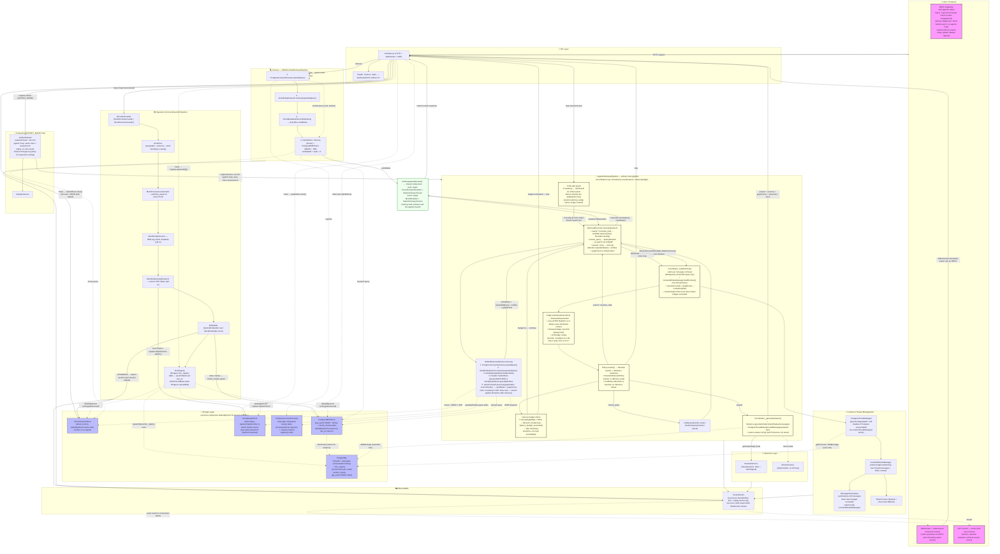

```mermaid
flowchart TB
    subgraph UserZone["👤 User / Frontend"]
        REST["REST endpoints:\n/ask (agentic Q&A)\n/inject  /inject-incremental  /clear (corpus management)\n/retrieve (diagnostic: direct hybrid search, no agentic loop)\n/capture-fixture (expert mode: golden dataset capture)"]
        WSc["WebSocket — bidirectional command channel\n(same operations as REST, plus streaming agent events)"]
        SSE["GET /events — server-sent event stream\n(metrics, injection progress, retrieval events, errors)"]
    end

    subgraph API["🔌 API Layer"]
        Server["RAGServer (HTTP + WebSocket + SSE)"]
        Health["/health  /metrics  /stats  — dashboard.html redirect at /"]
    end

    subgraph Ingestion["📥 Ingestion (ConcreteInjectionPipeline)"]
        direction TB
        Loader["DocumentLoader (RealDocumentLoader / MockDocumentLoader)"]
        Chunker["chunkText (paragraph→sentence→word boundary, overlap)"]
        Annotator["MockProvenanceAnnotator → authority_signal on every chunk"]
        NERTag["MockEntityExtractor — NER-tag chunk metadata (opt-in)"]
        RelExtract["MockRelationshipExtractor — extract SPO triples (opt-in)"]
        Embedder["Embedder (GeminiEmbedder real / MockEmbedder mock)"]
        Registry["DocRegistry\n(Postgres doc_registry table — upsert/delete per doc_id;\nJSON file fallback when Postgres unavailable)"]
    end

    subgraph Storage["💾 Storage Layer\n(all stores implement deleteByDocId for incremental sync)"]
        Chroma["ChromaVectorStore\n(dense vectors; deleteByDocId cleans stale chunks on re-ingest)"]
        BM25db["PostgresBM25Store\n(pg_search BM25 / Tantivy — bm25_chunks table;\ndeleteByDocId removes by doc_id column)"]
        Neo4j["Neo4jGraphStore\n(SPO triples; replaceTriplesForDoc is atomic delete+insert;\napoc.path.expand for depth-N traversal)"]
        Postgres["PostgreSQL\n• threads + messages  (conversation history)\n• doc_registry         (incremental sync state)\n• bm25_chunks          (pg_search BM25 index)"]
        Glossary["PostgresAcronymGlossary\n(manually maintained lookup table;\nnot populated by ingestion — requires explicit register() calls)"]
    end

    Reranker["AuthorityAwareReranker  ← shared component\n(real: wraps CrossEncoderReranker + StaticDictionaryScorer;\nmock: wraps MockReranker + StaticDictionaryScorer)\nUsed by both /retrieve and the agentic ExecN"]

    subgraph RetrievalA["🔍 /retrieve — NEREnrichedRetrievalPipeline\n(diagnostic endpoint — same expand→NER→filter→hybrid steps\nas UnifiedP but no graph traversal, no agentic loop;\nuse for direct search testing and benchmarking)"]
        direction TB
        QPA["1. PostgresAcronymGlossary.expand(query)"]
        NERA["2. MockEntityExtractor.extract(expandedQuery)"]
        FilterA["3. MockMetadataFilter.build(entities) → post-filter candidates"]
        HybridA["4. HybridStore: Chroma (dense) + PostgresBM25Store (BM25) + RRF\n   candidateK = topK × 4"]
    end

    subgraph AgenticLoop["🧠 AgenticRetrievalPipeline — primary /ask pipeline\n(Coordinator loop, bounded by maxIterations + latencyBudget)"]
        direction TB
        ColdStart["Cold-start guard\nif results=[] → call ExecN for initial search\nbefore entering the judge/policy loop\n(avoids wasting a judge call on empty context)"]
        BuildCtx["Coordinator._buildContext()\n• add user message to thread (deduped by sessionId+query key)\n• ContextWindowManager.buildContext() over thread history\n  + reranked results + graphFacts → contextPayload\n• summarisation fires here when token budget exceeded"]
        JudgeN["Judge.evaluate(observation) → RetrievalAssessment\n• runs AFTER BuildCtx so it always sees windowed context\n• RetrievalJudge: heuristic (always fast)\n• LLMJudge: wraps heuristic, escalates to LLM only in gray zone 0.4–0.7"]
        PolicyN["Policy.resolve() → Decision  (action + rationale + evidence)\n• HeuristicRetrievalPolicy (mock) / LLMPolicy (real)\n• LLMPolicy falls back to heuristic on inference failure"]
        TimeoutGuard["Latency budget check\nif remainingBudget < 50ms → Decision.create('stop', 'latency_budget_exceeded')\n→ skip remaining iterations, exit loop immediately"]
        ExecN["RetrievalExecutor.execute(decision)\n• search / increase_topk → UnifiedP.retrieve() then Reranker.rerank()\n• rewrite_query → QueryRewriter → re-search via UnifiedP\n• answer / stop → exit loop\nAttaches expandedQuery + entities + graphFacts to Observation"]
        Rewriter["LLMQueryRewriter (real) / HeuristicQueryRewriter (mock)"]
        UnifiedP["UnifiedRetrievalPipeline.retrieve()\n1. PostgresAcronymGlossary.expand(query)\n2. MockEntityExtractor.extract(expandedQuery)\n3. MockMetadataFilter.build(entities)\n4. Parallel: HybridStore (dense+BM25+RRF) ‖ Neo4jGraphStore.queryByEntities\n5. MockContextFuser.fuse(graphPaths, vectorChunks) → candidates + graphFacts\nNote: reranking is NOT done here — ExecN applies Reranker after retrieve()"]
        GenerateN["Coordinator._generateAnswer()\n• inference.generateChat(contextPayload.messages)\n• PostgresThreadManager.addMessage(assistant turn)\n• returns answer string (null if inference not wired)"]
    end

    subgraph ContextMgmt["💬 Context & Thread Management"]
        direction TB
        ThreadMgr["PostgresThreadManager\n(graceful degradation: self-disables if Postgres unreachable)\nvia createThreadManager() factory"]
        CtxWindow["ContextWindowManager\n(token-budget windowing over thread messages + RAG context)"]
        Summarizer["MessageSummarizer\n(summarises old messages when token budget exceeded;\ncalled inside ContextWindowManager)"]
        TokCtr["TokenCounter (tiktoken / char-count fallback)"]
    end

    subgraph Inference["🤖 Inference Layer"]
        direction TB
        Novita["NovitaInference (DeepSeek-R1, fetch + AbortSignal)"]
        MockInf["MockInference (deterministic, no API key)"]
    end

    subgraph Evaluation["🧪 Evaluation (EXPERT_MODE only)"]
        GoldenDS["GoldenDataset\n(captureFixture: runs full agentic loop, saves trace + assessment;\nreplay: re-runs saved fixtures through any policy for regression testing)"]
        Replay["ReplayHarness"]
    end

    subgraph Observability["📊 Observability"]
        Events["ServerEvents\n(in-process EventEmitter bus + rolling metrics log;\nfan-out to SSE stream AND WebSocket clients)"]
    end

    %% ── User ↔ API ───────────────────────────────────────────────────────
    UserZone -->|"HTTP request"| Server
    Server --> Health
    WSc -->|"bidirectional commands (same ops as REST)"| Server
    Events -.->|"push events to connected clients"| WSc

    %% ── /clear ───────────────────────────────────────────────────────────
    %% this.store = HybridStore → .clear() calls vectorStore.clear() + bm25Store.clear()
    %% Thread/conversation history in Postgres is NOT cleared.
    Server -->|"/clear → HybridStore.clear()\n(Chroma + BM25 both wiped)"| Chroma
    Server -.->|"/clear (via HybridStore)"| BM25db
    Server -.->|"/clear → graphStore.clear()"| Neo4j
    Server -.->|"/clear → registry.replaceAll({})"| Registry

    %% ── Ingestion (/inject full rebuild; /inject-incremental delta sync) ─
    Server -->|"/inject  /inject-incremental"| Loader
    Loader --> Chunker --> Annotator --> NERTag --> RelExtract --> Embedder
    Embedder -->|"embedBatch → upsert vectors (real: Gemini embed)"| Chroma
    Embedder -->|"index chunks → bm25_chunks upsert"| BM25db
    RelExtract -->|"storeTriples / replaceTriplesForDoc (atomic)"| Neo4j
    Embedder --> Registry
    Registry -.->|"upsert/delete doc_registry rows"| Postgres
    BM25db -.->|"backed by (same PG instance)"| Postgres
    %% Incremental sync: deleteByDocId fires on changed/removed docs
    Registry -.->|"deleteByDocId (changed/removed)"| Chroma
    Registry -.->|"deleteByDocId (changed/removed)"| BM25db
    Registry -.->|"deleteByDocId / replaceTriplesForDoc"| Neo4j

    %% ── /retrieve (diagnostic — no agentic loop) ──────────────────────
    Server -->|"/retrieve"| QPA
    QPA --> NERA --> FilterA --> HybridA
    HybridA -.->|"dense query"| Chroma
    HybridA -.->|"keyword query"| BM25db
    QPA -.->|"embed query (real: Gemini)"| HybridA
    QPA -.->|"expand"| Glossary
    HybridA -->|"candidates"| Reranker
    Reranker -->|"ranked results response"| Server

    %% ── /ask — unified agentic pipeline ──────────────────────────────
    Server -->|"/ask  sessionId  topK"| ColdStart
    ColdStart -->|"if results=[]: force initial ExecN search first"| ExecN
    ExecN -->|"Observation with results → enter loop"| BuildCtx
    BuildCtx --> JudgeN --> PolicyN
    PolicyN --> TimeoutGuard
    TimeoutGuard -->|"budget ok → continue"| ExecN
    TimeoutGuard -->|"budget exhausted → stop"| Server
    PolicyN -->|"rewrite_query"| Rewriter
    Rewriter --> ExecN
    PolicyN -->|"search / increase_topk"| ExecN
    ExecN --> UnifiedP
    UnifiedP -.->|"dense + BM25 + RRF"| Chroma
    UnifiedP -.->|"BM25 keyword"| BM25db
    UnifiedP -.->|"queryByEntities (apoc.path)"| Neo4j
    UnifiedP -.->|"expand query"| Glossary
    UnifiedP -->|"candidates + expandedQuery + entities + graphFacts"| ExecN
    ExecN -->|"Reranker.rerank(query, candidates)"| Reranker
    Reranker -->|"reranked Observation"| ExecN
    ExecN -->|"Observation.withResults().withEnrichment() → next iteration"| BuildCtx
    BuildCtx --> ThreadMgr
    ThreadMgr -.->|"getOrCreate / addMessage (user turn)"| Postgres
    ThreadMgr --> CtxWindow
    CtxWindow --> Summarizer
    CtxWindow --> TokCtr
    PolicyN -->|"answer"| GenerateN
    GenerateN -->|"generateChat() (real)"| Novita
    GenerateN -.->|"mock mode"| MockInf
    GenerateN -.->|"addMessage (assistant turn)"| Postgres
    GenerateN -->|"answer + sources + graphFacts + sessionId + trace"| Server
    PolicyN -->|"stop"| Server
    Server --> UserZone

    %% ── /capture-fixture ─────────────────────────────────────────────
    Server -->|"/capture-fixture (EXPERT_MODE)"| GoldenDS
    GoldenDS -->|"captureFixture: run full agentic loop, save trace+assessment"| AgenticLoop
    GoldenDS --> Replay

    %% ── SSE + observability fan-in ───────────────────────────────────
    Events -.->|"stream"| SSE
    Ingestion --> Events
    RetrievalA --> Events
    AgenticLoop --> Events
    ContextMgmt --> Events
    Inference --> Events

    classDef external fill:#f9f,stroke:#333,stroke-width:2px;
    classDef storage fill:#bbf,stroke:#333;
    classDef loop fill:#ffd,stroke:#333,stroke-width:2px;
    classDef shared fill:#efe,stroke:#393,stroke-width:2px;
    class REST,WSc,SSE external;
    class Chroma,BM25db,Neo4j,Postgres,Glossary storage;
    class ColdStart,BuildCtx,JudgeN,PolicyN,TimeoutGuard,ExecN,GenerateN loop;
    class Reranker shared;
```
