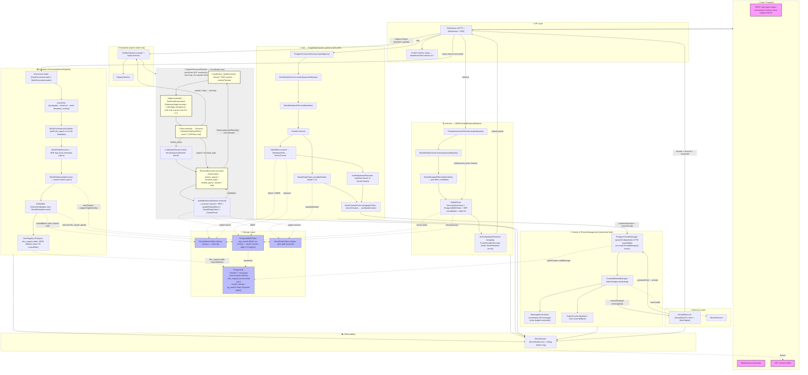

```mermaid
flowchart TB
    subgraph UserZone["👤 User / Frontend"]
        REST["REST: /ask /inject /inject-incremental /retrieve /clear /capture-fixture"]
        WSc["WebSocket Commands"]
        SSE["GET /events (SSE)"]
    end

    subgraph API["🔌 API Layer"]
        Server["RAGServer (HTTP + WebSocket + SSE)"]
        Health["/health /metrics /stats — dashboard.html redirect at /"]
    end

    subgraph Ingestion["📥 Ingestion (ConcreteInjectionPipeline)"]
        direction TB
        Loader["DocumentLoader (RealDocumentLoader / MockDocumentLoader)"]
        Chunker["chunkText (paragraph→sentence→word boundary, overlap)"]
        Annotator["MockProvenanceAnnotator (authority_signal on chunk metadata)"]
        NERTag["MockEntityExtractor — NER-tag chunk metadata (opt-in)"]
        RelExtract["MockRelationshipExtractor — extract triples (opt-in)"]
        Embedder["Embedder (GeminiEmbedder real / MockEmbedder mock)"]
        Registry["DocRegistry (Postgres doc_registry table; JSON fallback when PG unavailable)"]
    end

    subgraph Storage["💾 Storage Layer"]
        Chroma["ChromaVectorStore (dense vectors — Chroma)"]
        BM25db["PostgresBM25Store\n(pg_search BM25 via Tantivy — bm25_chunks table in Postgres)"]
        Neo4j["Neo4jGraphStore (triples, apoc.path traversal)"]
        Postgres["PostgreSQL\n• threads + messages (conversation history)\n• doc_registry (incremental sync)\n• bm25_chunks + pg_search index (keyword BM25)"]
    end

    subgraph RetrievalA["🔍 /retrieve — NEREnrichedRetrievalPipeline"]
        direction TB
        QPA["PostgresAcronymGlossary.expand(query)"]
        NERA["MockEntityExtractor.extract(expandedQuery)"]
        FilterA["MockMetadataFilter.build(entities) → post-filter candidates"]
        HybridA["HybridStore: ChromaVectorStore + PostgresBM25Store + RRF (candidateK = topK×4)"]
        RerankerA["AuthorityAwareReranker wrapping CrossEncoderReranker (real) / MockReranker (mock)"]
    end

    subgraph AskPath["💬 /ask — GraphRAGPipeline (primary Q&A path)"]
        direction TB
        QPB["PostgresAcronymGlossary.expand(query)"]
        NERB["MockEntityExtractor.extract(expandedQuery)"]
        FilterB["MockMetadataFilter.build(entities)"]
        ParallelB["Parallel retrieval"]
        GraphTrav["Neo4jGraphStore.queryByEntities (depth 1–2)"]
        VectorPath["HybridStore.search → MetadataFilter → vectorChunks"]
        Fuser["MockContextFuser.fuse(graphPaths, vectorChunks) → combinedContext"]
        RerankerB["AuthorityAwareReranker (optional rerank of vectorChunks)"]
    end

    subgraph ContextMgmt["💬 Context & Thread Management (wired into /ask)"]
        direction TB
        ThreadMgr["PostgresThreadManager (graceful degradation if PG unavailable)\nvia createThreadManager() factory"]
        CtxWindow["ContextWindowManager (token-budget windowing)"]
        Summarizer["MessageSummarizer (summarize old messages when budget exceeded)"]
        TokCtr["TokenCounter (tiktoken / char-count fallback)"]
    end

    subgraph Inference["🤖 Inference Layer"]
        direction TB
        Novita["NovitaInference (DeepSeek-R1, fetch + AbortSignal)"]
        MockInf["MockInference"]
    end

    subgraph AgenticLoop["🧠 AgenticRetrievalPipeline — Coordinator loop\n(wired but NOT invoked by any HTTP endpoint;\nused only via /capture-fixture → GoldenDataset)"]
        direction TB
        BuildCtx["Coordinator._buildContext(): thread + RAG context → contextPayload"]
        JudgeN["Judge.evaluate() → RetrievalAssessment\n(RetrievalJudge heuristic; LLMJudge escalates to LLM only in gray zone 0.4–0.7)"]
        PolicyN["Policy.resolve() → Decision\n(HeuristicRetrievalPolicy mock / LLMPolicy real)"]
        ExecN["RetrievalExecutor.execute() → Observation\nactions: search / increase_topk / rewrite_query / answer / stop"]
        Rewriter["LLMQueryRewriter (real) / HeuristicQueryRewriter (mock)"]
        UnifiedP["UnifiedRetrievalPipeline.retrieve()\n= acronym expand + NER + parallel(HybridStore + Neo4jGraphStore) + ContextFuser"]
    end

    subgraph Evaluation["🧪 Evaluation (expert mode only)"]
        GoldenDS["GoldenDataset (capture + replay fixtures)"]
        Replay["ReplayHarness"]
    end

    subgraph Observability["📊 Observability"]
        Events["ServerEvents (EventEmitter bus + rolling metrics log)"]
    end

    %% ── User ↔ API ──────────────────────────────────────────────────────
    UserZone --> Server
    Server --> Health

    %% ── Ingestion (/inject, /inject-incremental) ────────────────────────
    Server -->|"/inject  /inject-incremental"| Loader
    Loader --> Chunker --> Annotator --> NERTag --> RelExtract --> Embedder
    Embedder -.->|"embedBatch (real: Gemini API)"| Chroma
    Embedder -.->|"store (bm25_chunks upsert)"| BM25db
    RelExtract -.->|"storeTriples / replaceTriplesForDoc"| Neo4j
    Embedder --> Registry
    Registry -.->|"doc_registry table (upsert/delete)"| Postgres
    BM25db -.->|"backed by"| Postgres

    %% ── /retrieve path ──────────────────────────────────────────────────
    Server -->|"/retrieve"| QPA
    QPA --> NERA --> FilterA --> HybridA --> RerankerA
    HybridA -.->|"dense query"| Chroma
    HybridA -.->|"keyword query"| BM25db
    QPA -.->|"embed query (real: Gemini)"| HybridA
    RerankerA -->|"ranked results"| Server

    %% ── /ask path ───────────────────────────────────────────────────────
    Server -->|"/ask"| QPB
    QPB --> NERB --> FilterB --> ParallelB
    ParallelB --> GraphTrav
    ParallelB --> VectorPath
    GraphTrav -.->|"queryByEntities"| Neo4j
    VectorPath -.->|"dense + BM25"| Chroma
    VectorPath -.->|"keyword"| BM25db
    GraphTrav --> Fuser
    VectorPath --> RerankerB
    RerankerB --> Fuser
    Fuser -->|"combinedContext + vectorChunks"| ThreadMgr
    ThreadMgr -.->|"getOrCreate / addMessage"| Postgres
    ThreadMgr --> CtxWindow
    CtxWindow --> Summarizer
    CtxWindow --> TokCtr
    CtxWindow -->|"contextPayload (messages[])"| Novita
    CtxWindow -.->|"mock mode"| MockInf
    Novita -->|"generateChat → answer"| ThreadMgr
    Novita -->|"answer + sources + sessionId"| Server
    Server --> UserZone

    %% ── Agentic loop (not wired to HTTP, used via GoldenDataset) ────────
    Server -->|"/capture-fixture (EXPERT_MODE)"| GoldenDS
    GoldenDS --> AgenticLoop
    BuildCtx --> JudgeN --> PolicyN
    PolicyN -->|"rewrite_query"| Rewriter
    Rewriter --> ExecN
    PolicyN -->|"search / increase_topk"| ExecN
    ExecN --> UnifiedP
    UnifiedP -.->|"hybrid search"| Chroma
    UnifiedP -.->|"BM25"| BM25db
    UnifiedP -.->|"graph traversal"| Neo4j
    UnifiedP -->|"candidates"| ExecN
    ExecN -->|"Observation.withResults() → next iteration"| BuildCtx
    PolicyN -->|"answer / stop → exit loop"| GoldenDS
    GoldenDS --> Replay

    %% ── SSE / observability ─────────────────────────────────────────────
    Events -.->|"stream"| SSE
    Ingestion --> Events
    RetrievalA --> Events
    AskPath --> Events
    AgenticLoop --> Events
    ContextMgmt --> Events
    Inference --> Events

    classDef external fill:#f9f,stroke:#333,stroke-width:2px;
    classDef storage fill:#bbf,stroke:#333;
    classDef loop fill:#ffd,stroke:#333,stroke-width:2px;
    classDef inactive fill:#eee,stroke:#999,stroke-dasharray:5 5;
    class REST,WSc,SSE external;
    class Chroma,BM25db,Neo4j,Postgres storage;
    class BuildCtx,JudgeN,PolicyN,ExecN loop;
    class AgenticLoop inactive;
```